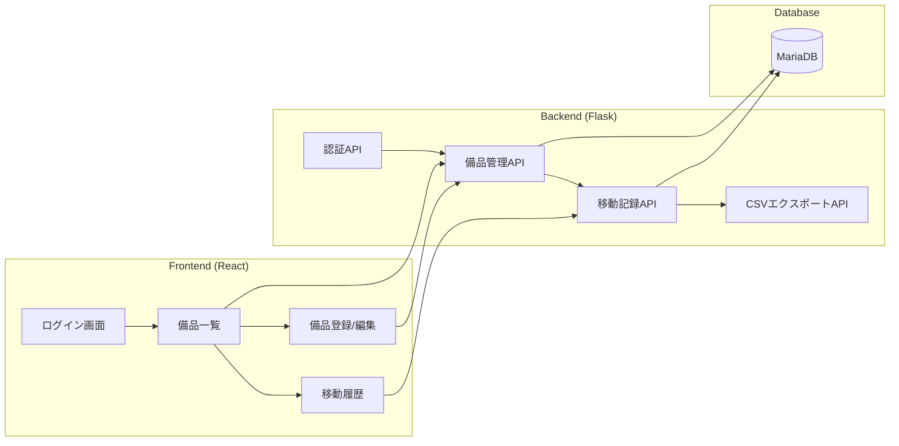
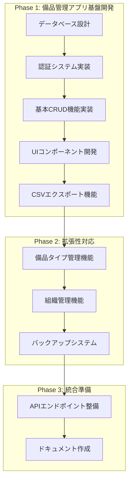

# 山岳研究班備品管理ツール 実装計画書

## システムアーキテクチャ

## 開発フロー

## 実装スケジュール（5週間）

### Week 1: データベース設計
- MariaDBのセットアップと設定
- bihinテーブルとmovementテーブルの作成
- インデックス最適化
- バックアップスクリプトの作成

### Week 2-3: バックエンド開発
- 技術スタック：Python 3.9+, Flask 2.0+
- 認証システムの実装（共通パスワード認証）
- 備品管理APIの実装
  - 備品登録・編集・削除
  - 移動履歴記録
  - CSVエクスポート
- 週次バックアップシステムの実装

### Week 3-4: フロントエンド開発
- 技術スタック：React 18+, TypeScript, Chakra UI
- モバイルファーストのUIデザイン実装
- 主要コンポーネント開発
  - ログイン画面
  - 備品一覧表示（ソート機能付き）
  - 備品登録・編集フォーム
  - 移動履歴管理画面

### Week 4: 拡張機能開発
- マスターデータ管理機能
  - 備品タイプの管理
  - 組織データの管理
- CSVエクスポート機能の実装
- エラーハンドリングの実装

### Week 5: テストとドキュメント作成
- テストコードの作成
  - バックエンド単体テスト
  - APIの統合テスト
  - フロントエンドコンポーネントテスト
- ドキュメント作成
  - システム構成図
  - API仕様書
  - ユーザーマニュアル
  - 開発環境セットアップガイド

## 技術スタック詳細

### バックエンド
- Python 3.9+
- Flask 2.0+
- Flask-Login（認証用）
- SQLAlchemy（ORマッパー）
- MariaDB Connector

### フロントエンド
- React 18+
- TypeScript
- Chakra UI
- Axios（API通信）
- React Query（状態管理）

### データベース
- MariaDB 10.5+
- 週次バックアップ設定

### 開発ツール
- Git（バージョン管理）
- ESLint + Prettier（コード整形）
- PyTest（Pythonテスト）
- Jest（Reactテスト）

## 次のステップ
1. 開発環境のセットアップ
2. データベーススキーマの詳細設計
3. APIエンドポイントの設計
4. フロントエンドのコンポーネント設計

実装フェーズに移行する準備が整いました。コードの実装を開始してよろしいでしょうか？